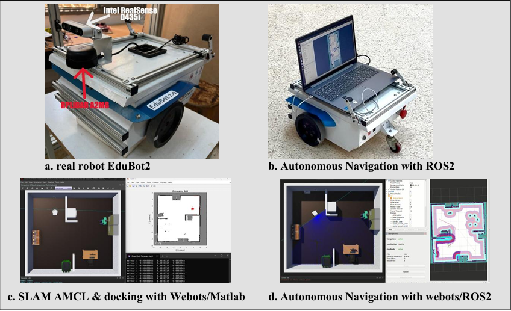
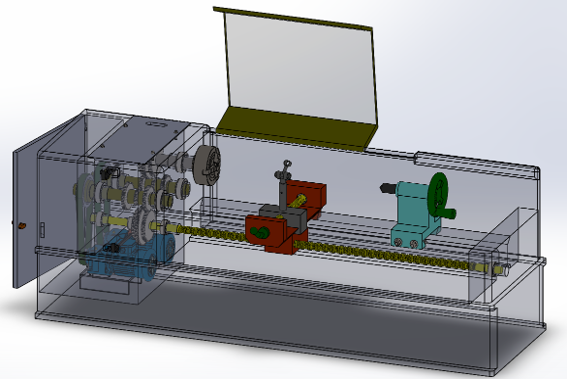
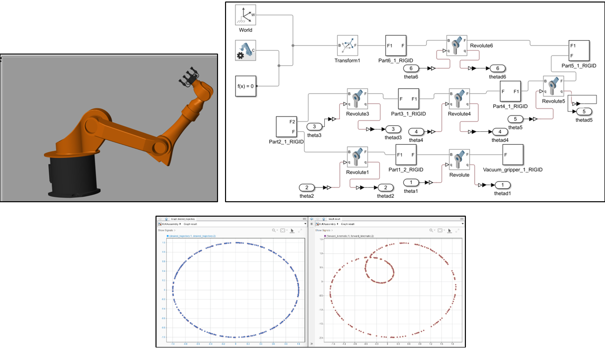

# Emmanuel Ablo
Mechanical Engineer | Robotics & AI   |  📧 emmanuelablo01@gmail.com | 🔗 [LinkedIn](https://www.linkedin.com/in/emmanuel-ablo-a3262b211/) | [GitHub](https://github.com/emmanuelablo)

## About Me
Mechanical Engineer with strong foundations in mechanical design, electromechanics, machine automation, and industrial troubleshooting. Experienced in CAD modeling, mechanical systems integration, maintenance, and prototyping. Complemented by solid skills in robotics (ROS2, SLAM, control), experimental validation, and sensor integration. Able to work across the full engineering pipeline, from mechanical conception and simulation to implementation on real equipment

[my CV](https://flowcv.com/resume/uj9nswfpk5k2)

---

## Projects
### EduBot2 Autonomous Navigation System (Master’s Thesis) | Jan -> Jun 2025
- Built a ROS 2-based navigation system using SLAM Toolbox and Nav2.
- Developed simulation on MATLAB/Webots and deployed on real robot with LiDAR & RGB-D.
- [Video Demo](https://youtu.be/vsBix_fgd3E) | [Code](https://github.com/EmmanuelAblo/EduBot2) 

### Actuated Camera Mount System Design (SolidWorks, Fusion, Inventor) jan -> feb 2026
- Designed and modeled an actuated camera mount system in SolidWorks, including full part design, assembly structure, and technical drawings.
- Re-designed the complete system in Autodesk Fusion and Inventor to strengthen cross-platform proficiency.
- Strengthened my skills in parametric modeling, constraints, joints, and drawing generation across different CAD platforms.

- In Solidworks: [Solidwork video](https://youtu.be/saXXKsKDktc)

  

- In Autodesk Inventor: [Inventor demo](https://youtu.be/saXXKsKDktc)

### Automatic Welding Machine (Bachelor’s Thesis) | feb -> jun 2023
- Designed & simulated an automated welding system in SolidWorks.
- Performed structural analysis, motor integration, and feasibility studies.
- [Video Demo](https://youtu.be/saXXKsKDktc)

### Simulation & Control of KUKA KR16 | Oct 2024
- Simulated KUKA KR16 robot with SolidWorks → Simscape model.
- Implemented inverse kinematics & PID tuning for precise 6-DOF control.
- .[See Report](https://drive.google.com/file/d/1RiIsL1uNzCk8d3_JBdHjDYpltp28ptNd/view?usp=sharing) | [Code](https://drive.google.com/file/d/1ta9bqaMWKkcKgAOfRw_Ejnwkj2xaRmov/view?usp=sharing)

---

## Pubications and Contributions
- **Contributor to AfROB’s 2025 State of Robotics in Africa (SORA) Report**:  
  - *Industry – Agriculture Deep Dive*  
  - *Research & Innovation – High-output Academic Research Program*

- **Open-source autonomous robot simulation**:  
  - *Published open-source repository of EduBot2 autonomous robot simulation with ROS 2 packages and controllers.*  

---

## Skills
-  **Mechanical & Mechatronics Engineering**:
Mechanical systems troubleshooting | Manufacturing processes: machining (lathe, milling), forming, welding | 
Materials selection & mechanical assemblies | Industrial maintenance

-  **Control, Automation & Robotics**:
Control systems (PID, trajectory tracking) | ROS2, SLAM, navigation | Sensor fusion (LiDAR, IMU, odometry) | 
Embedded systems | Modbus TCP/IP

-  **Simulation & Modeling**:
MATLAB/Simulink | SolidWorks, CATIA, Abaqus (FEM basics) | Webots, Gazebo, RViz

-  **Programming & Data Analysis**:
Python (NumPy, Pandas, OpenCV) | C/C++ for control | Linux / Git / Bash scripting
-  **AI & ML**
Linear and logistic Regression | TensorFlow, Keras, Scikit-learn | Reinforcement learning (basics)

-  **Experimental Methods**:
Sensor integration (LiDAR, encoders, cameras) | Data acquisition & calibration | prototyping (3D printing, 
mechanical assembly) | Real-robot experiments & validation

-  **Research & Communication**:
Scientific writing | Literature review & bibliographic research | Data visualization & technical presentations

